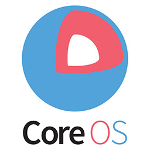
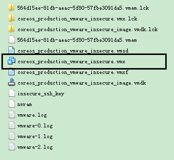
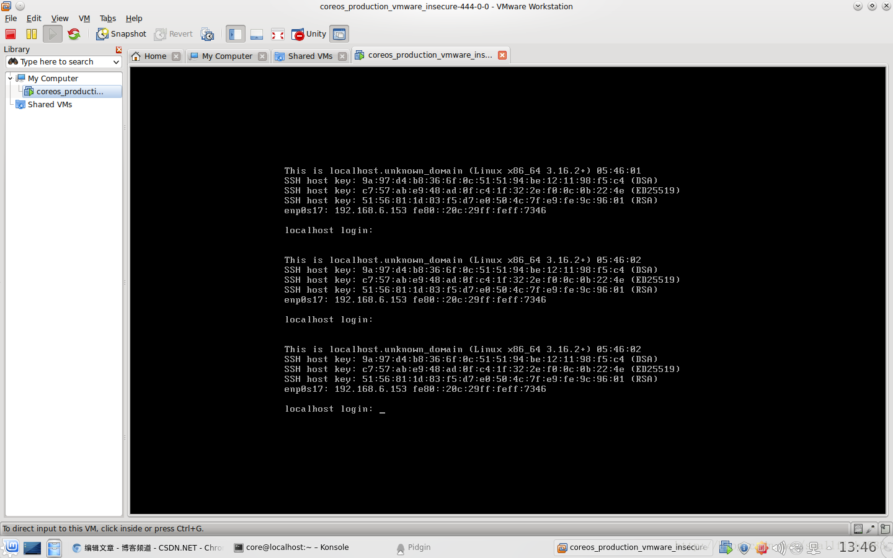
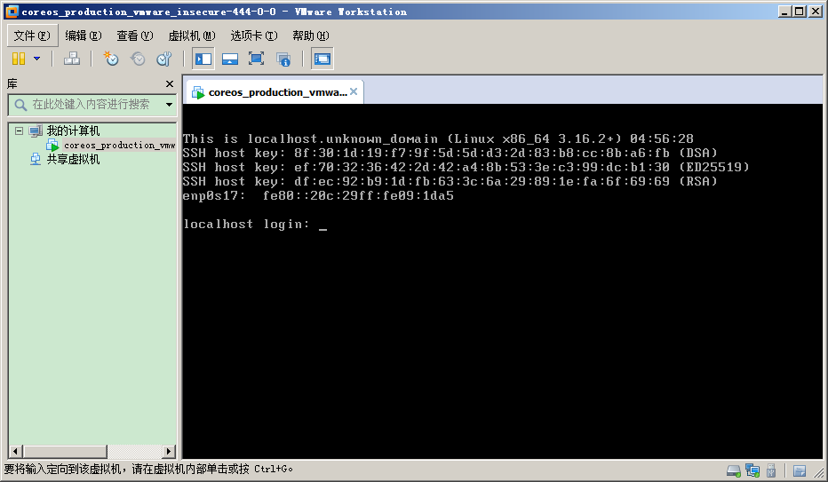
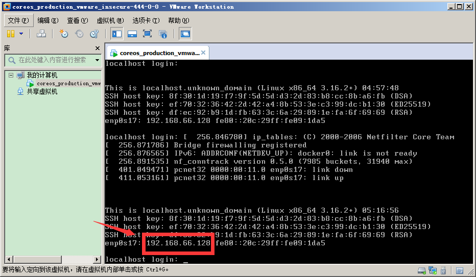
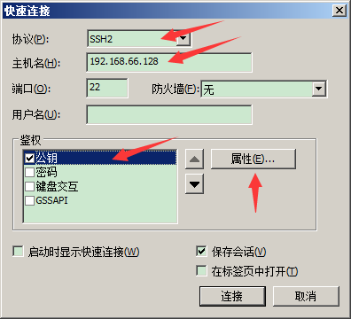
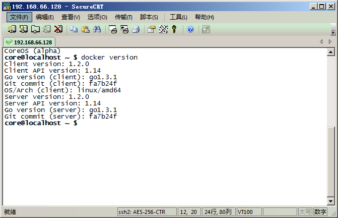
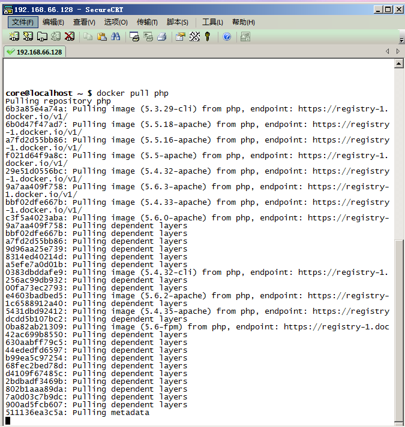

## CoreOS

### 简介



CoreOS 是一个轻量级容器化 Linux 发行版，专为数据中心场景而设计，旨在通过轻量的系统架构和灵活的应用程序部署能力简化数据中心的维护成本和复杂度。CoreOS 作为 Docker 生态圈中的重要一员，日益得到各大云服务商的重视。CoreOS 于 2014 年 7 月首次发布了稳定版本。

与其他历史悠久、使用广泛的 Linux 操作系统相比，CoreOS 拥有下面几个优点。

* CoreOS 通过容器化（Containerized）的运算环境向应用程序提供运算资源。

传统类 Unix 系统往往提供包管理工具。随着系统安装更多的程序，而程序的依赖要求各不相同，这就容易出现“依赖地狱”（Dependency Hell），系统的更新和安装会非常痛苦。

CoreOS 的应用程序通过 Docker 运行在容器中，彼此之间共享系统内核和资源，同时互不可见。这种方式使得操作系统、应用程序及运行环境之间的耦合度大大降低。相对于传统的部署方式而言，运维可以更加灵活便捷的在 CoreOS 集群中部署应用程序，同时各运行环境之间的干扰更少，操作系统自身的维护也更加容易。

* CoreOS 采用双系统分区（Dual Root Partition）设计。

CoreOs 的两个分区在系统运行期间各司其职，它们分别被设置成主动模式和被动模式。主动分区负责系统运行，被动分区负责系统升级。一旦 CoreOS 发布了新版系统，运维只需下载一个完整的系统安装文件至被动分区，然后设置系统下一次重启时从新版本分区启动，将主、被动分区的职能进行调换即可。在 CoreOS 系统运行期间，系统分区被设置成只读状态，这样也确保了 CoreOS 的安全性。CoreOS 的升级过程在默认条件下将自动完成，并且通过 cgroup 对升级过程中使用到的网络和磁盘资源进行限制，这将系统升级所带来的影响降至最低。

* CoreOS 使用 Systemd 取代 SysV 作为系统和服务的管理工具。

与 SysV 相比，Systemd 不仅可以更好的追踪系统进程，还具备优秀的并行化处理能力。Systemd 将自己的按需启动的特性与 Docker 的快速启动能力相结合，在 CoreOS 集群中大规模部署 Docker Containers 的业务中优势明显。Systemd 引入了“target”的概念，每个 target 应用于一个特定的服务，并且可以通过继承一个已有的 target 来扩展额外的功能，即操作系统对系统上运行的服务拥有更好的控制力。

CoreOS 团队还推出了很多有益的工具，包括 etcd, fleet, flannel 等。

安装 CoreOS 有几种方法，笔者推荐初学者使用 VMware Workstation 虚拟机方式来运行 CoreOS。VMware Workstation 工具则可以前往其官网`http://www.vmware.com/products/workstation/` 下载获取。

### 使用官方镜像

#### 获取虚拟机镜像
从官方网站下载 CoreOS 镜像，地址为 [https:\/\/coreos.com\/releases\/](http://alpha.release.core-os.net/amd64-usr/current/coreos_production_vmware_insecure.zip)。

如果读者已经安装 VMware Workstation，则解压镜像包后双击`vmx` 文件：
！

双击`vmx` 文件后，即可启动 CoreOS 虚拟机，如下图所示：



*注意：使用免费版 VMware Player 运行 CoreOS 官方镜像时，可能出现无法通过 DHCP 自动获取 IP 地址的问题，读者可配置静态地址或使用 VMware Workstation 来运行 `vmx` 文件。*

#### 获取地址信息

此时CoreOS 系统已经在 VMware Station 中启动，显示登录提示：



直接按回车键，获取当前系统的 IP 地址，如下图所示：



如上图所示，查看此时 CoreOS 的 IP地址是：`192.168.66.128`。

#### 使用 SSH 客户端访问镜像

笔者以 Windows 环境为例，使用 SecureCRT 工具进行连接。此处读者需要确定：

* CoreOS 虚拟机的 IP地址
* CoreOS 虚拟机的文件目录下含有 `insecure_ssh_key` 公钥文件

打开 SecureCRT，建立新的 SSH 连接，如下图示：



点击 ` 属性` 按钮添加 `insecure_ssh_key` 公钥文件后，即可点击 `连接`。

如果连接成功，则读者可以看到命令行页面，读者在命令行中查看 Docker 的版本信息：

```bash
$ docker version
```

结果如下图示：



此时，CoreOS 虚拟机已经成功运行，并且读者可以使用 SSH 客户端方便的操作 CoreOS 虚拟机。 Docker 已经内置于 CoreOS 中，读者可以进行各种 Docker 操作，如下图示：



如果读者的本机环境是 Linux 系统，读者可以使用 SSH 公钥（在解压后的根目录下），直接使用 `ssh` 命令连接 CoreOS 虚拟机，并使用 `ip a` 命令查看 IP 地址信息。

如下所示：

```bash
$ ssh -i ~/insecure_ssh_key core@192.168.6.153
CoreOS (alpha)
core@localhost ~ $ ls
core@localhost ~ $ docker ps
CONTAINER ID        IMAGE               COMMAND             CREATED             STATUS              PORTS               NAMES
core@localhost ~ $ ip a
1: lo: <LOOPBACK,UP,LOWER_UP> mtu 65536 qdisc noqueue state UNKNOWN
    link/loopback 00:00:00:00:00:00 brd 00:00:00:00:00:00
    inet 127.0.0.1/8 scope host lo
       valid_lft forever preferred_lft forever
    inet6 ::1/128 scope host
       valid_lft forever preferred_lft forever
2: enp0s17: <BROADCAST,MULTICAST,UP,LOWER_UP> mtu 1500 qdisc pfifo_fast state UNKNOWN qlen 1000
    link/ether 00:0c:29:ff:73:46 brd ff:ff:ff:ff:ff:ff
    inet 192.168.6.153/20 brd 192.168.15.255 scope global dynamic enp0s17
       valid_lft 604500sec preferred_lft 604500sec
    inet6 fe80::20c:29ff:feff:7346/64 scope link
       valid_lft forever preferred_lft forever
3: docker0: <NO-CARRIER,BROADCAST,MULTICAST,UP> mtu 1500 qdisc noqueue state DOWN
    link/ether 56:84:7a:fe:97:99 brd ff:ff:ff:ff:ff:ff
    inet 172.17.42.1/16 scope global docker0
       valid_lft forever preferred_lft forever
core@localhost ~ $
```

### 相关资源

* `CoreOS` 官网：`https://coreos.com/`
* `CoreOS` 官方仓库：`https://github.com/coreos/`
